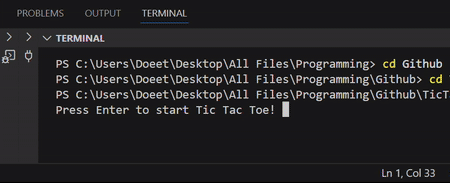

# Tic-Tac-Toe
### Description
Play a game of Tic-Tac-Toe on your terminal!
<p align="left">
  
</p>

### Code Overview
<p align="left">
  
</p>

### Learning Overview
 - input()
 - frontend vs. backend
 - UI
 - Github README (formatting text, images, and GIFs)

## Random Experimentation
<p align="center">
  <span style="font-size:20px; font-family:'Times New Roman', Times, serif;">
    Centered Times New Roman Text
  </span>
</p>

```python
import shenanigans as hehehe
# avada kedavra!!!
def munchables(pastries):
  return hehehe.guess(what_this_is)
```
